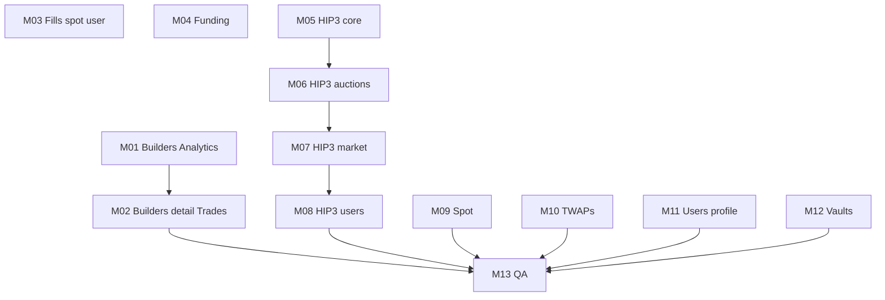

# Plan de suite — HypeDexer (HL Indexer) & sous-agents

Document pour **l’orchestrateur** : état actuel, ordre recommandé, parallélisation, critères de fin, prompts à coller pour chaque sous-agent.

## État au repo (référence)

**Chiffres canoniques** : section **Summary** de [`docs/hypedexer_endpoints.inventory.md`](../../hypedexer_endpoints.inventory.md) (régénérer après tout changement de routes / script d’inventaire).

| Zone | Détail |
|------|--------|
| Spec OpenAPI | `docs/hypedexer_endpoints.json` — resync : `curl -sS https://api-eu.hypedexer.com/openapi.json -o docs/hypedexer_endpoints.json` |
| Inventaire | `npm run hypedexer:inventory` → `docs/hypedexer_endpoints.inventory.md` |
| Couverture REST `/indexer/*` | Liste exhaustive des paths proxifiés : tableau **Proxied via `/indexer/*`** dans l’inventaire (incl. fills, funding, overview, analytics, builders, completed-trades, HIP-3, spot, twaps, users, vaults). |
| **Missing / Partial** | **0** missing, **0** partial (au dernier inventaire : 69 opérations OpenAPI, 68 implémentées côté REST hypedexer/rest ; écart = `GET /ws` géré par WebSocket). |
| Hors scope REST | `GET /ws` → `src/clients/hypedexer/websocket/` |

Les fichiers **MISSION-01 … MISSION-13** sont **archivés** sous [`archive/`](./archive/) (référence historique pour l’ordre d’implémentation).

## Règles communes (tous les sous-agents)

1. **Tout le HTTP HL Indexer** vit sous `src/clients/hypedexer/rest/<domain>/` (polling + pass-through `/indexer`).
2. **Routes publiques** : préfixe **`/indexer/...`** (cohérent avec l’existant), sauf décision produit documentée dans `docs/CLIENT_ARCHITECTURE.md` §11.
3. **Réponse HTTP** : `{ success: true, data: <payload upstream> }` ; erreurs upstream → **502** + code snake_case (comme les routes indexer actuelles).
4. **Redis** : pas de polling sur endpoints lourds ; cache court seulement si utile — clés / canaux dans `src/constants/hypedexer.cache.ts`.
5. **Rate limit / CB** : un **circuit breaker + rate limiter par domaine** (nouveau nom si nouveau client), pas un limiter par endpoint.
6. **Fin de mission** : `npm run build` ; mettre à jour **`scripts/hypedexer-openapi-inventory.ts`** (`HYPEDEXER_REST_INDEXER_MOUNT`) pour chaque nouveau path proxifié ; puis `npm run hypedexer:inventory`.

## Carte des missions (fichiers détaillés)

| ID | Fichier | Domaine | Endpoints (ordre logique) |
|----|---------|---------|---------------------------|
| M01 | [MISSION-01.md](./archive/MISSION-01.md) | Analytics + Builders | 5 |
| M02 | [MISSION-02.md](./archive/MISSION-02.md) | Builders path + Completed trades | 5 |
| M03 | [MISSION-03.md](./archive/MISSION-03.md) | Fills user + spot | 3 |
| M04 | [MISSION-04.md](./archive/MISSION-04.md) | Funding | 3 |
| M05 | [MISSION-05.md](./archive/MISSION-05.md) | HIP-3 core | 5 |
| M06 | [MISSION-06.md](./archive/MISSION-06.md) | HIP-3 auctions / fills / leaderboard | 5 |
| M07 | [MISSION-07.md](./archive/MISSION-07.md) | HIP-3 market data | 5 |
| M08 | [MISSION-08.md](./archive/MISSION-08.md) | HIP-3 users | 3 |
| M09 | [MISSION-09.md](./archive/MISSION-09.md) | Spot indexer | 4 |
| M10 | [MISSION-10.md](./archive/MISSION-10.md) | TWAPs | 5 |
| M11 | [MISSION-11.md](./archive/MISSION-11.md) | Users profile | 3 |
| M12 | [MISSION-12.md](./archive/MISSION-12.md) | Vaults | 6 |
| M13 | [MISSION-13.md](./archive/MISSION-13.md) | Contrôle final + overview | QA / pas nouveaux paths massifs |

## Ordre recommandé et parallélisation

**Vague 1 (peu de dépendances, priorité produit “visible”)**

- **M01** seul d’abord si tu veux **corriger `/builders/list`** et analytics fills avant le reste.
- **M03** et **M04** peuvent tourner **en parallèle** (fills spot/user vs funding) — aucun chevauchement de fichiers si un agent touche `fills/` et l’autre `funding/`.

**Vague 2**

- **M02** (completed trades + builders `{address}`) après ou en parallèle de M01 si les chemins builders de M01 sont déjà mergés (éviter deux PR sur le même `builders` client).

**Vague 3 — HIP-3**

- **M05 → M06 → M07 → M08** dans cet ordre **dans le même repo** pour limiter les conflits git sur un futur gros `hip3.client.ts` ; alternative : un sous-agent crée la **structure** (`hip3/` + router vide) puis les autres remplissent par sous-fichiers `hip3/assets.client.ts`, etc.

**Vague 4**

- **M09** (spot) et **M10** (twaps) **en parallèle** une fois HIP-3 stable ou sur branches séparées.

**Vague 5**

- **M11** (users `/{user}/…`) — attention collision sémantique avec `/user` (auth) : garder sous `/indexer/users/...`.
- **M12** (vaults) — valider avec l’équipe produit vs `/market/vaults` Hyperliquid.

**Clôture**

- **M13** : inventaire **Missing = 0** (hors note `/ws`), revue §11 CLIENT_ARCHITECTURE, pas de doublon `top-traders` inutile — état atteint ; garder l’inventaire à jour après toute évolution OpenAPI.



## Brief type à coller pour un sous-agent (1 mission)

Copier-coller et remplacer `MISSION-XX` :

```text
Tu travailles sur le backend LiquidTerminal_Back (Node/Express/TS).

Mission : exécute UNIQUEMENT le fichier docs/agents/hypedexer/archive/MISSION-XX.md (ou le playbook équivalent pour de nouveaux lots d’endpoints).
- Respecte docs/CLIENT_ARCHITECTURE.md section 11 et le pattern existant dans src/routes/indexer/, src/clients/hypedexer/rest/, src/services/indexer/.
- Max 3–5 endpoints listés dans la mission ; ne dépasse pas ce périmètre.
- Après implémentation : mets à jour scripts/hypedexer-openapi-inventory.ts (tableau HYPEDEXER_REST_INDEXER_MOUNT) pour chaque route /indexer ajoutée, puis documente la commande npm run hypedexer:inventory.
- npm run build doit passer.
Ne modifie pas le plan dans .cursor/plans/.
```

## Rôle orchestrateur (“chef”)

1. Ouvrir **PLAN_SUITE_SOUS_AGENTS.md** (ce fichier) + **hypedexer_endpoints.inventory.md** (colonne Missing).
2. Lancer **1 sous-agent = 1 MISSION-XX** (jamais “tout HIP-3” en un bloc).
3. Exiger une **PR / branche par mission** ou merge séquentiel si même domaine (HIP-3).
4. Après chaque merge : `npm run hypedexer:inventory` et vérifier que **Missing** reste **0** (sauf nouvelle opération dans l’OpenAPI en amont).
5. Si conflit produit (vaults vs market, users vs auth) : trancher le préfixe URL et mettre à jour §11.

## Référence rapide fichiers “modèle”

- Client : `src/clients/hypedexer/rest/fills/fills.client.ts`
- Service : `src/services/indexer/indexer-fills.service.ts`
- Routes : `src/routes/indexer/fills.routes.ts`
- Mount : `src/routes/indexer/index.ts` + `src/app.ts` (`/indexer`)
- Test (optionnel) : `tests/unit/indexer/indexer-fills.service.test.ts`
- Script couverture : `scripts/hypedexer-openapi-inventory.ts`

---

*Dernière mise à jour : alignée sur l’inventaire généré par `npm run hypedexer:inventory`.*
